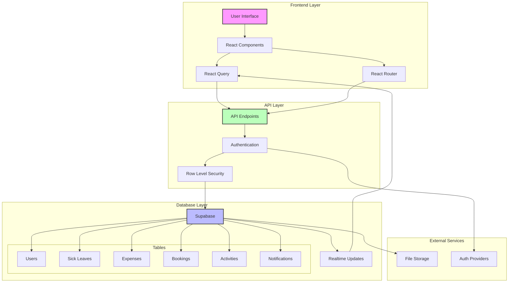
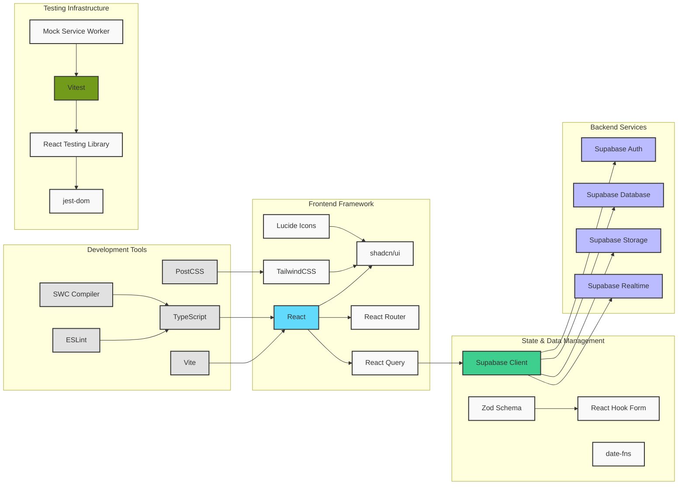

# WorkLife Nexus Hub

A comprehensive workplace management system that helps employees manage their work-life balance through various automated processes and requests.

🌐 **Live Application**: [https://officetool2.netlify.app/](https://officetool2.netlify.app/)

## Database Architecture

### 🗄️ Supabase Database
WorkLife Nexus Hub uses Supabase as its primary database, providing:
- **Real-time Updates**: Instant synchronization of data changes
- **Row Level Security**: Fine-grained access control
- **Type Safety**: Full TypeScript integration
- **Authentication**: Built-in user management

### Key Tables
- **users**: Employee profiles and authentication
- **sick_leaves**: Sick leave requests and status
- **expenses**: Expense claims and receipts
- **bookings**: Resource reservations
- **activities**: User action logging
- **notifications**: System notifications

### System Architecture



### Service Connections & Tools



## Application Layout

### 🎨 UI Structure
1. **Sidebar Navigation**
   - User profile section
   - Main navigation menu
   - Quick access buttons
   - System status indicators

2. **Header Area**
   - Section title
   - Action buttons
   - Search functionality
   - Notifications

3. **Main Content Area**
   - Dynamic content based on selected section
   - Responsive grid layout
   - Card-based components
   - Data tables and forms

4. **Design System**
   - Levi9's brand colors and gradients
   - Modern card layouts with hover effects
   - Consistent spacing and typography
   - Responsive breakpoints
   - Interactive animations

## Portal Actions

### 👤 User Management
- **Profile Management**
  - Update personal information
  - Change password
  - Set notification preferences
  - Configure two-factor authentication

### 🏥 Sick Leave
- **Request Management**
  - Submit new sick leave requests
  - Upload medical certificates
  - Track request status
  - View leave history
  - Cancel pending requests
  - Receive approval notifications

### 💼 Resource Booking
- **Company Resources**
  - Book meeting rooms
  - Reserve company cars
  - Schedule equipment usage
  - View availability calendar
  - Manage recurring bookings
  - Cancel or modify reservations

### 💰 Expense Management
- **Financial Operations**
  - Submit expense claims
  - Upload receipts
  - Track reimbursement status
  - View expense history
  - Generate expense reports
  - Export data to Excel

### 📚 Education & Training
- **Learning Management**
  - Browse available courses
  - Register for training sessions
  - Track learning progress
  - Download certificates
  - Submit feedback
  - View upcoming events

### 🔧 Maintenance Requests
- **Facility Management**
  - Report facility issues
  - Track repair status
  - Upload issue photos
  - Rate service quality
  - View maintenance history
  - Receive status updates

### 📊 Analytics Dashboard
- **Data Visualization**
  - View personal statistics
  - Track department metrics
  - Monitor resource utilization
  - Analyze expense patterns
  - Export custom reports
  - Set up automated reports

## Features

### 🎯 Dashboard Overview
- Real-time statistics and metrics
- Quick access to common actions
- Recent activity tracking
- System status monitoring
- Automation rate tracking

### 🏥 Sick Leave Management
- Submit and track sick leave requests
- Detailed view of leave requests including:
  - Start and end dates
  - Duration calculation
  - Request status tracking
  - Reason documentation
  - Timeline of request updates
- Multiple leave types support
- Request editing for pending submissions

### 🚗 Travel & Booking
- Company car booking system
- Trip scheduling and management
- Upcoming bookings tracking

### 💰 Expense Management
- Receipt upload functionality
- Monthly expense tracking
- Quick reimbursement processing
- Expense analytics

### 📊 Analytics & Reporting
- Monthly expense summaries
- Pending requests overview
- Approved items tracking
- Upcoming bookings monitoring

## Testing

### 🧪 Test Setup
- **Vitest** - Test runner with Jest-like API
- **React Testing Library** - Component testing utilities
- **MSW (Mock Service Worker)** - API mocking
- **@testing-library/jest-dom** - Custom DOM element matchers

### Test Suites

#### Dashboard Tests
- Welcome message rendering
- Quick stats display (pending requests, approved items)
- Recent activities list
- Quick actions functionality
- System status indicators (automation rate, system status)

#### Sick Leave Details Tests
- Loading state handling
- Error state for non-existent requests
- Successful data display
- Timeline information
- Edit functionality for pending requests

### Running Tests

```sh
# Run all tests
npm test

# Run tests in watch mode
npm test -- --watch

# Run tests with coverage
npm test -- --coverage
```

### Test Utils
- Custom render function with React Router and React Query setup
- Supabase client mocking
- MSW handlers for API request interception
- Common test data fixtures

## Project info

**URL**: https://lovable.dev/projects/41e3839d-44f8-4058-b80d-7c90dd715c59

## Technologies Used

This project is built with modern web technologies:

### Core Technologies
- **Vite** - Next Generation Frontend Tooling
- **TypeScript** - For type-safe code
- **React** - UI Framework
- **shadcn-ui** - Beautifully designed components
- **Tailwind CSS** - Utility-first CSS framework
- **date-fns** - Modern JavaScript date utility library
- **Lucide Icons** - Beautiful & consistent icons
- **React Router** - For seamless navigation
- **React Query** - Powerful data synchronization
- **Supabase** - Backend and database management
- **Zod** - Schema validation

### Testing Tools
- **Vitest** - Modern testing framework
- **React Testing Library** - Component testing
- **MSW** - API mocking
- **@testing-library/user-event** - User interaction simulation
- **@testing-library/jest-dom** - DOM matchers

### Development Tools
- **ESLint** - Code linting
- **TypeScript ESLint** - TypeScript-specific linting
- **SWC** - Fast JavaScript/TypeScript compiler
- **PostCSS** - CSS processing
- **Autoprefixer** - Vendor prefix management

## Getting Started

### Prerequisites
- Node.js & npm - [install with nvm](https://github.com/nvm-sh/nvm#installing-and-updating)

### Installation

```sh
# Step 1: Clone the repository using the project's Git URL.
git clone <YOUR_GIT_URL>

# Step 2: Navigate to the project directory.
cd <YOUR_PROJECT_NAME>

# Step 3: Install the necessary dependencies.
npm i

# Step 4: Start the development server with auto-reloading and an instant preview.
npm run dev
```

### Available Scripts

```sh
# Start development server
npm run dev

# Build for production
npm run build

# Build for development
npm run build:dev

# Run tests
npm test

# Run tests with UI
npm run test:ui

# Run tests with coverage
npm run test:coverage

# Run tests in watch mode
npm run test:watch

# Run linting
npm run lint

# Preview production build
npm run preview
```

## Alternative Development Methods

### Use Lovable

Simply visit the [Lovable Project](https://lovable.dev/projects/41e3839d-44f8-4058-b80d-7c90dd715c59) and start prompting.
Changes made via Lovable will be committed automatically to this repo.

### Edit Directly in GitHub

1. Navigate to the desired file(s)
2. Click the "Edit" button (pencil icon)
3. Make your changes and commit

### Use GitHub Codespaces

1. Navigate to the main repository page
2. Click the "Code" button (green)
3. Select "Codespaces"
4. Click "New codespace"
5. Edit files and commit changes

## Deployment

Simply open [Lovable](https://lovable.dev/projects/41e3839d-44f8-4058-b80d-7c90dd715c59) and click on Share -> Publish.

## Custom Domain Setup

To connect a custom domain:
1. Navigate to Project > Settings > Domains
2. Click Connect Domain
3. Follow the setup instructions

For detailed instructions, visit: [Setting up a custom domain](https://docs.lovable.dev/tips-tricks/custom-domain#step-by-step-guide)
